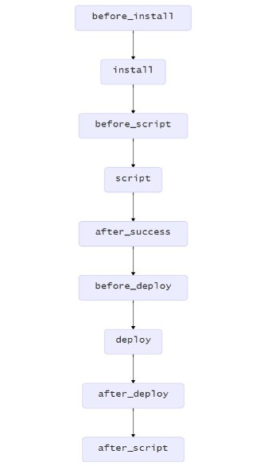

## Continuous Integration

- The practice of merging in small code changes frequently 
- The goal is to build healthier software by developing and testing in smaller increments.

---

### Travis-CI

- *supports* your development process by automatically building and testing code changes, providing immediate feedback on the success of the change.
- *automate* other parts of your development process by managing deployments and notifications.

---

### Core Concepts

- *phase*:  the sequential steps of a job. For example, the `install` phase,  `script` phase,  `deploy` phase. 
- *job*: an automated process that carries out a series of `phases` such as compiling your code, running tests.

---

- *build*:  a group of `jobs`.  A *build* finishes when all of its `jobs` are finished 
- *stage*: a group of `jobs`that run in parallel as part of a sequential build process composed of multiple `stages`. 

---

### Broken Build

- *errored*:  a command in the `before_install`, `install`, or `before_script` phase returned a non-zero exit code. 
- *failed*:  a command in the `script` phase returned a non-zero exit code. 
- *canceled*:   a user cancels the job before it completes. 

---

### Job Lifecycle

- *install* : install any dependencies required
- *script* : run the build script and the test script



---

### Customizing  Phase

```yaml
install: ./install-dependencies.sh

install:
  - bundle install --path vendor/bundle
  - npm install
  
script:
  - bundle exec rake build
  - bundle exec rake builddoc

script: bundle exec rake build && bundle exec rake builddoc
```

---

### Build Matrix

- *combine* a language-and-environment dependent set of configuration options to automatically create a matrix of all possible combinations 
- *specify* the exact combination of configurations you want in `matrix.include` 

---

```yaml
rvm:
  - 2.5
  - 2.2
gemfile:
  - gemfiles/Gemfile.rails-3.2.x
  - gemfiles/Gemfile.rails-3.0.x
env:
  - ISOLATED=true
  - ISOLATED=false
```

---

```yaml
jobs:
  include: //exclude
  - rvm: 2.5
    gemfile: gemfiles/Gemfile.rails-3.2.x
    env: ISOLATED=false
  - rvm: 2.2
    gemfile: gemfiles/Gemfile.rails-3.0.x
    env: ISOLATED=true
```
---

### Using different Programming Language

```yaml
dist: xenial
language: php
php:
  - '5.6'
jobs:
  include:
    - language: python
      python: 3.6
      script:
        - python -c "print('Hi from Python!')"
```

---

### Build Stage

A way to group jobs, and run jobs in each stage in parallel, but run one stage after another sequentially. 

```yaml
jobs:
include:
  - stage: test
    script: ./test 1
    script: ./test 2
  - stage: deploy
    script: ./deploy
```

---

### Specifying Stage Oder

specify the order for stages in the section stages

```yaml
stages:
  - compile
  - test
  - deploy
```

---

### Conditional Builds, Stages and Jobs

```yaml
// Add `if:branch=master`

stages:
  - name: deploy
    if: branch = master
```

---

## Get Start

- *Go* to [Travis-ci.com](https://travis-ci.com/) and [*Sign up with GitHub*](https://travis-ci.com/signin).  
- Accept the Authorization of Travis CI.  
- Click the green *Activate* button and select the repositories you want to use with Travis CI. 
- Add a `.travis.yml` file to your repository, git commit and push to trigger a Travis CI build.

---

### Build Specific Branched

Add safelist and blocklist

```yml
# blocklist
branches:
  except:
  - legacy
  - experimental

# safelist
branches:
  only:
  - master
  - stable
```

---

### Installing a Second Language

In the `before_install ` stage of the build 

```yaml
language: python

before_install:
- rvm install 2.1.5

language: node_js

before_install:
- phpenv global 7.0
```

---

### Use docker

```yaml
services:
  - docker

```

- docker push/pull
- docker build ...


