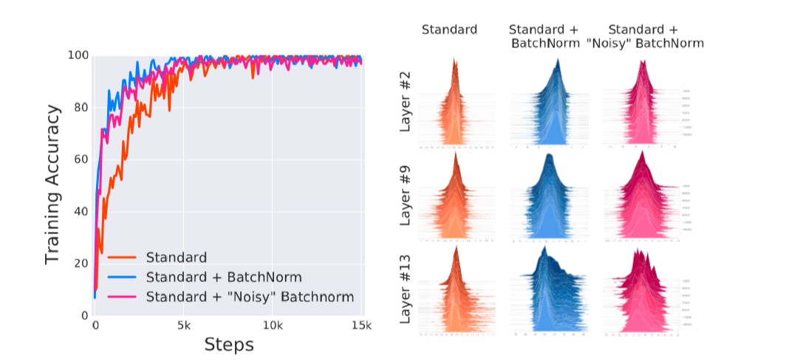
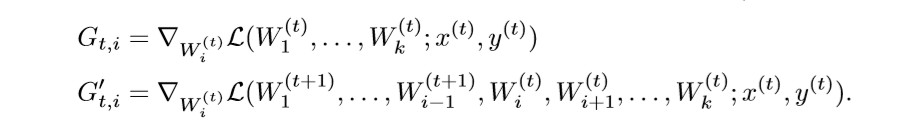
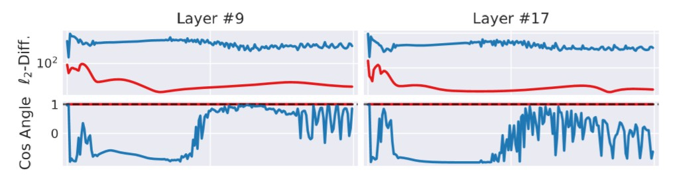
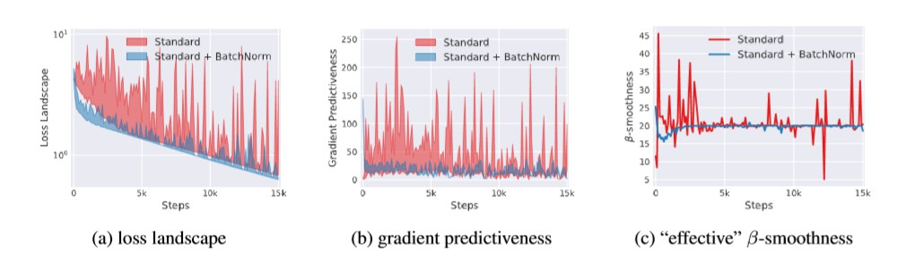
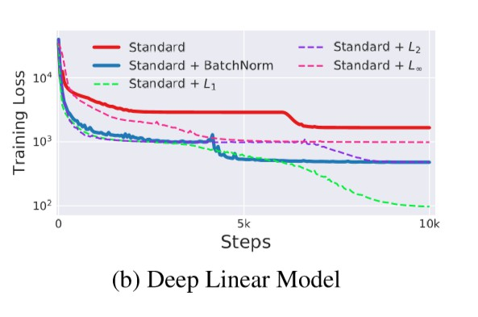

<head>
    
    
</head>
## Batch Normalization

- `popular belief`:

  *controlling* the change of the layers’ input distributions during training to reduce the so-called “internal covariate shift”

- `truth`:

  *makes* the optimization landscape significantly smoother, inducing a more predictive and stable behavior of the gradients, allowing for faster training.

---

## ICS

- *ICS* refers to the change in the distribution of layer inputs caused by updates to the preceding layers. 
- *conjectured* that such continual change negatively impacts training. 
- *BatchNorm* might not even be reducing internal covariate shift. 

---

## Impact

- *makes* the landscape of the corresponding optimization problem significantly more smooth
- *gradients* are more predictive and thus allows for use of larger range of learning rates and faster network convergence
- *under* natural conditions, the `Lipschitzness` of both the loss and the gradients  are improved in models with BatchNorm

---

## controlling internal covariate shift?

- *train* networks with random noise injected after BatchNorm layers. Specifically, we perturb each activation for each sample in the batch using i.i.d. noise sampled from a non-zero mean and non-unit variance distribution
- *visualizes* the training behavior of standard, BatchNorm and “noisy” BatchNorm networks

---

---

## BatchNorm Increase ICS

---

---

## The smoothing effect of BatchNorm

- *non-BatchNorm*, deep neural network, the loss function tends to have a large number of “kinks”
- *makes* the gradients more reliable and predictive, enables any (gradient–based) training algorithm to take larger steps

---

---

## $L_{p}-Normalization$

- *normalizes* them by the average of their `p-norm `

---

